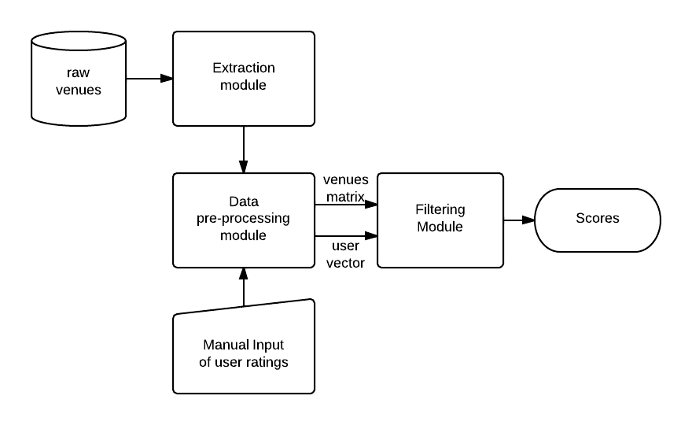

## Recommender System : basic skeleton 
---

Since we have to implement a basic content-based RS I think it's time to speak about how we want to organize the code. The idea is to build something that will be usefull for the next steps and won't force us to reimplement too much. 

My idea is to do something like that : 

As you can see it's very basic for now. Since we are all working on different parts I don't know precisely what you need. It would be nice if you could quickly have a look and give me some feedback.

### The extraction module

It's responsable for reading the raw venues and extracting only the components we want. The prototype might be :

        def Extract
        input  : JSON formated venues
        output : Matrix of features/venues

I put an entire module for this because I think after a while we will directly store the preprocessed venues and bypass this step. 

### Data pre-processing module

Resposible for normalizing the vectors, preprocessing the values ...

### Filtering module 

Computes the distances between the venues and the user vector given a certain metric.  

### Scalability 

As a first step everything will be achieve without clusters. But if you see some modifications that could be done now and make the scaling part easier feel free.

### Context Aware Recommender

We also plan on taking the user's context into account when recommending a venue. See [[this|context.md]] page for more details.

